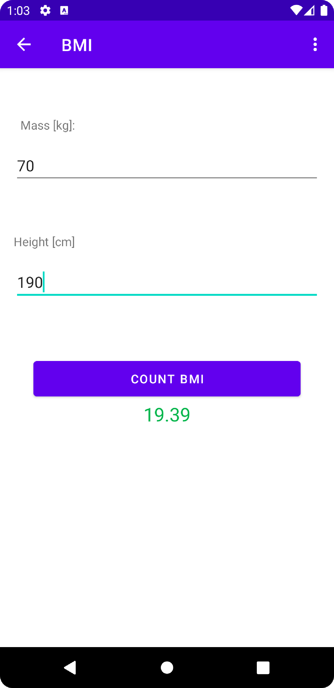
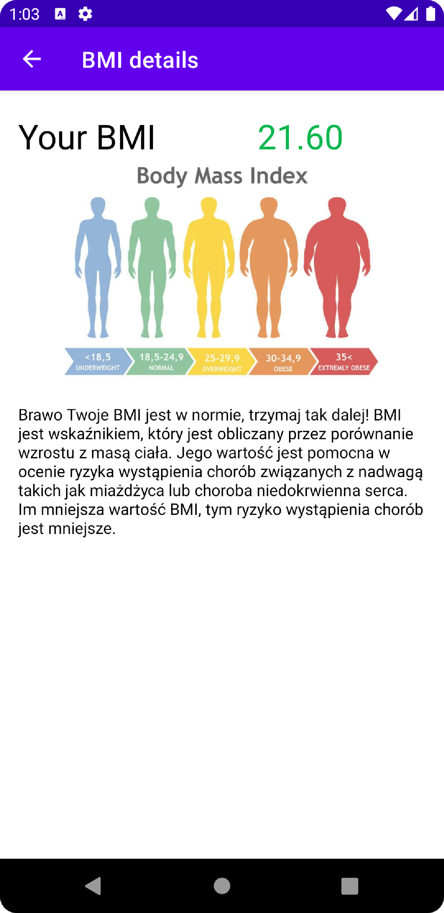
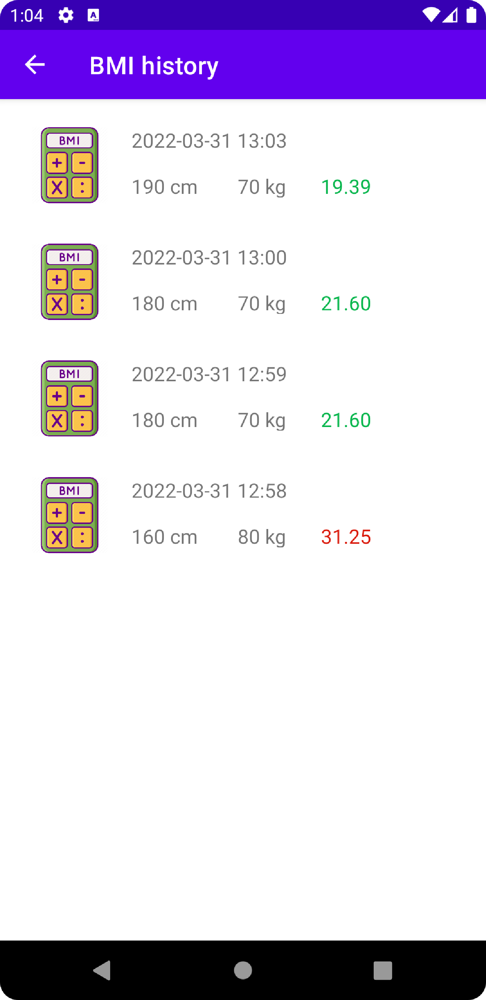

# BMI-calculator
Simple application on Android to count BMI with Kotlin.

## Table of Contents
* [General Info](#general-information)
* [Technologies Used](#technologies-used)
* [Features](#features)
* [Screenshots](#screenshots)
* [Setup](#setup)
* [Project Status](#project-status)
* [Room for Improvement](#room-for-improvement)
* [Contact](#contact)

## General Information

## Technologies Used
- Kotlin data class
- SQLiteOpenHelper to store BMI history in memory
- Kotlin version 1.4.10
- RecyclerView-v7 version 28.0.0
- Sdk version 31

## Features
List the ready features here:
- Obliczanie BMI na podstawie wzrostu i wagi w jednostkach europejskich i brytyjskich
- Sugerowanie działania na podstawie obliczonego BMI
- Prowadzenie historii BMI

## Screenshots
### Strona wprowadzania danych

### Strona ze wskazówkami

### Historia BMI

<!--
Przegląd głównych ekranów aplikacji
Strona wprowadzania danych

Strona ze wskazówkami

Historia BMI

-->

## Setup
1. Download the samples by cloning this repository
2. In the welcome screen of Android Studio, select "Open an Existing project"
3. Select one of the sample directories from this repository

Alternatively, use the `gradlew build` command to build the project directly

## Project Status
Project is: _complete_

## Room for Improvement
Room for improvement:
- Ikona aplikacji

To do:
- Sugerowane działania na podstawie historii

## Contact
Created by [@HKonstanty](https://github.com/HKonstanty/HKonstanty) - feel free to contact me!